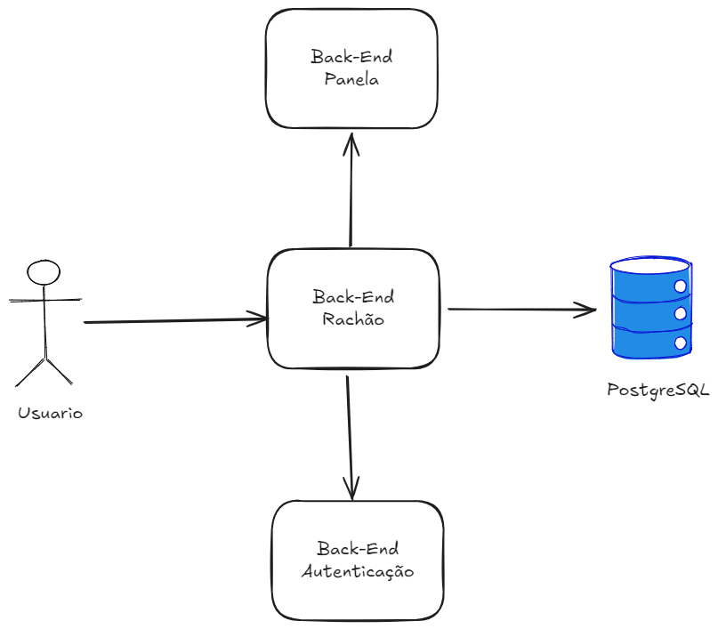
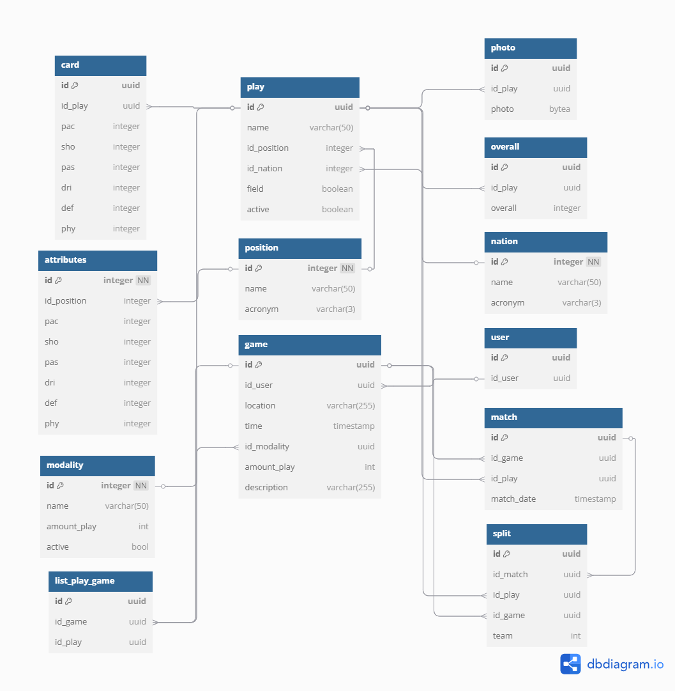

# Rachão

Rachão é um projeto criado para organizar partidas de forma equilibrada, utilizando cards personalizados inspirados nos cards do FIFA. Cada jogador possui um card com atributos e estatísticas individuais.

A montagem dos times é feita com base em uma fórmula de cálculo que considera esses atributos, garantindo que as equipes fiquem equilibradas e que o jogo seja mais competitivo e justo para todos os participantes.

# Arquitetura

# Arquitetura de Microsserviços — Sistema Rachão

## 📚 Visão Geral

Esta arquitetura é baseada em microsserviços, com um serviço principal responsável por orquestrar a comunicação entre os demais componentes e realizar o CRUD dos dados da aplicação. Cada microsserviço tem responsabilidade única e bem definida, permitindo escalabilidade, manutenibilidade e independência de desenvolvimento.

---

## 🧩 Componentes da Arquitetura

### 🔧 Rachão (Serviço Principal)
- Responsável pelas operações CRUD da aplicação.
- Atua como **orquestrador** da arquitetura.
- Exposição de endpoints para o frontend e/ou usuários.
- Realiza chamadas aos serviços de autenticação e panela.
- Responsável por persistir e consultar os dados no banco PostgreSQL.

### 🤝 Panela (Microsserviço de Times)
- Serviço independente.
- Processamento e organização de **times** no sistema.
- Consultado pelo Rachão sempre que for necessário:
  - Criar ou sortear equipes.
  - Aplicar regras de formação de times.

### 🔐 Autenticação
- Serviço independente responsável por:
  - Autenticar usuários.
  - Gerar e validar tokens (ex: JWT).
- Consultado pelo Rachão durante processos de:
  - Login.
  - Registro.
  - Verificação de permissões de acesso.

### 🗃️ Banco de Dados (PostgreSQL)
- Utilizado exclusivamente pelo serviço Rachão.
- Armazena os dados principais do sistema.
- Modelo relacional, ideal para integridade e consistência de dados.

---

# 📋 Features

### 🛡️ Autenticação de Usuários
- Registro de novos jogadores.
- Login e emissão de token JWT.
- Verificação e renovação de sessões autenticadas.

### 📝 Gestão de Cards
- Cadastro de atributos por jogador (força, velocidade, habilidade, etc).
- Atualização e edição de atributos dos cards.
- Visualização dos cards de todos os jogadores.

### 🎲 Montagem de Times
- Criação automática de times equilibrados.
- Algoritmos de balanceamento utilizando atributos dos jogadores.

### 📊 Estatísticas de Partidas

### ⚙️ Administração
- Interface administrativa para gerenciar jogadores, partidas e configurações do sistema.

---

# 🔮 Futuras Melhorias

- Capitão.
- Atualização automática de estatísticas dos jogadores (gols, assistências, desempenho).
- Registro dos resultados dos jogos.

---

# 🚀 Tecnologias Utilizadas

- **Linguagem**: GOLANG / GIN.
- **Banco de Dados**: PostgreSQL.
- **Comunicação entre serviços**: REST APIs.
- **Autenticação**: JWT.
- **Deploy**: Docker(futuro).

---

# 🛢️ Modelo de Banco de Dados

O banco de dados é composto pelas seguintes tabelas:

- **play**: Armazena informações básicas do jogador (nome, posição, nação, ativo/campo).
- **card**: Contém os atributos individuais de um jogador (PAC, SHO, PAS, DRI, DEF, PHY).
- **attributes**: Atributos genéricos por posição (padrões de atributos para posições específicas).
- **position**: Cadastro de posições (ex.: goleiro, zagueiro, atacante) e siglas.
- **nation**: Cadastro de nacionalidades e siglas.
- **photo**: Foto do jogador armazenada em bytea.
- **overall**: Avaliação geral (nota) do jogador.

---